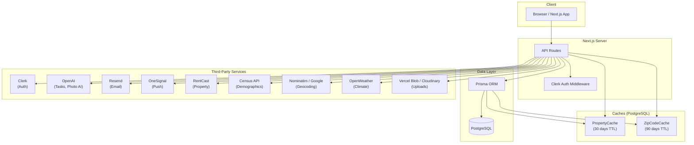
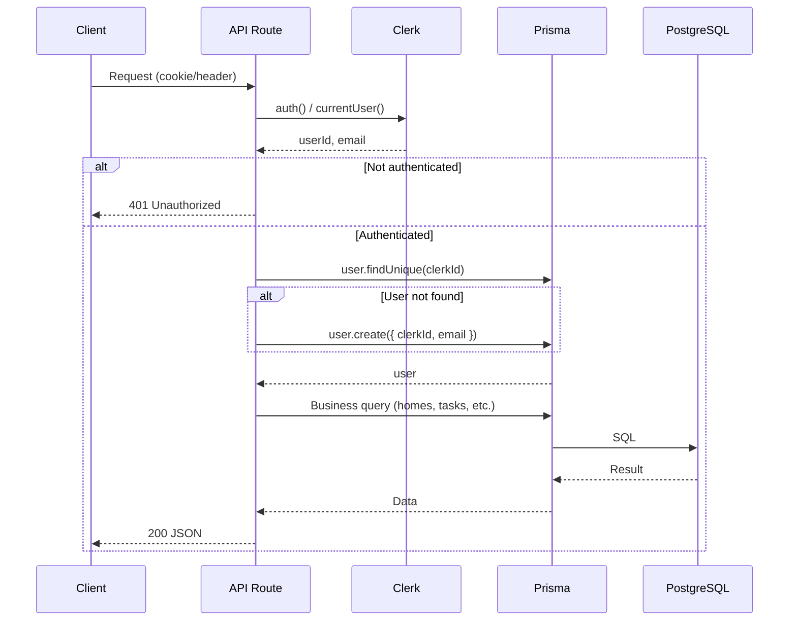
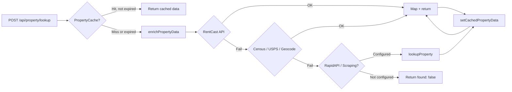
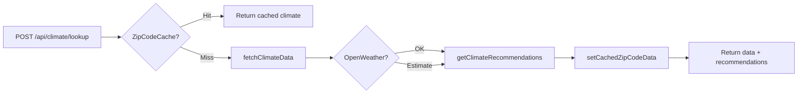
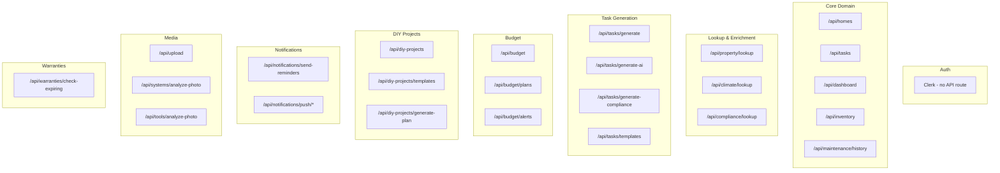
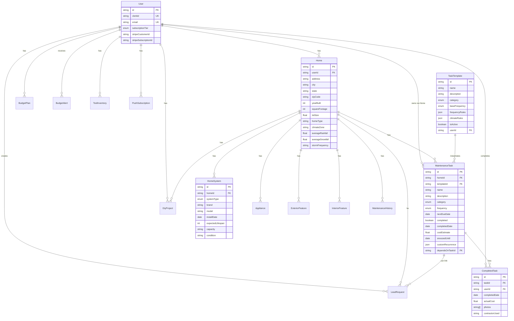
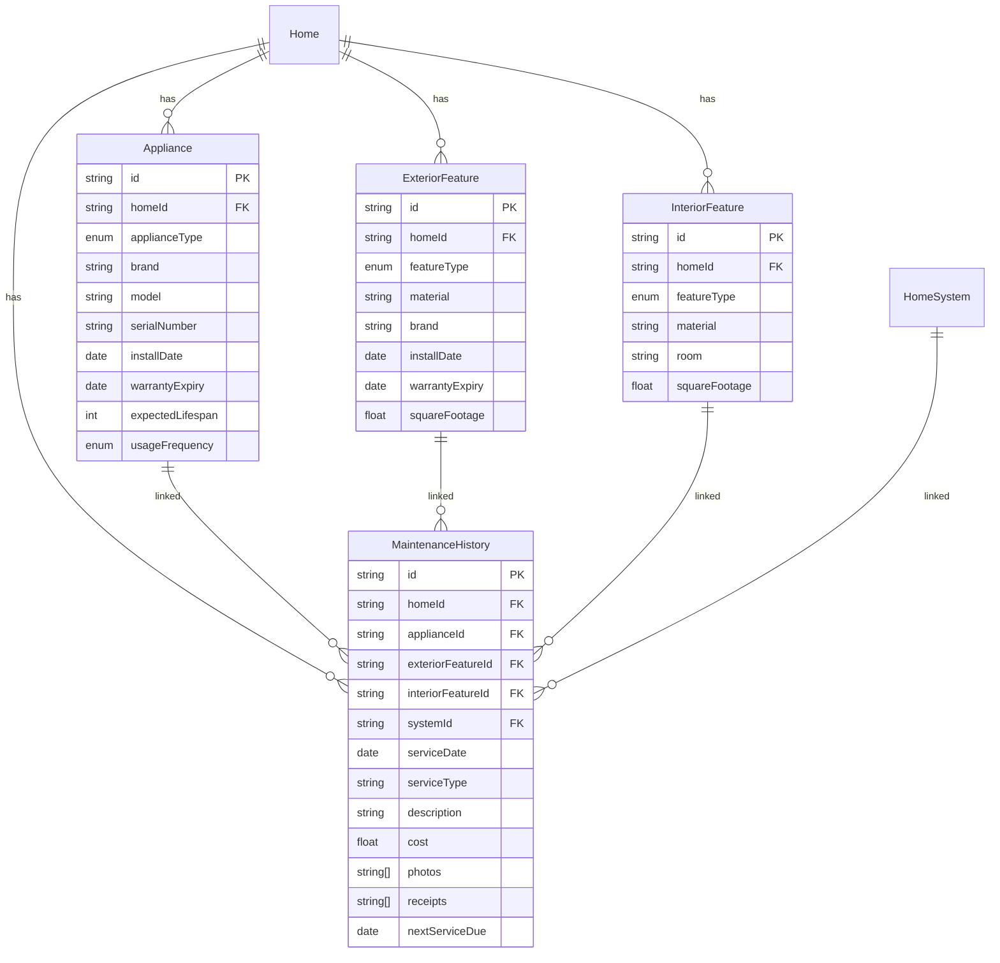
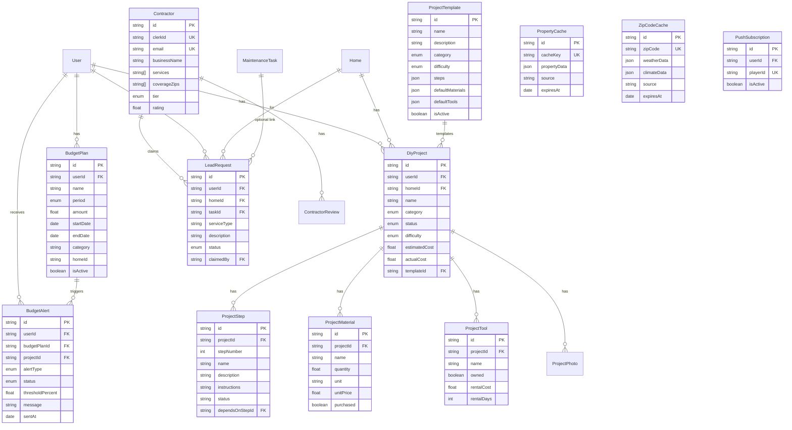

# Architecture & Data Model

This document uses [Mermaid](https://mermaid.js.org/) diagrams to describe system architecture, API flow, and the PostgreSQL data structure. Render it in GitHub, GitLab, or any Markdown viewer that supports Mermaid.

---

## 1. High-Level System Architecture

---

## 2. Typical API Request Flow (Authenticated)

Most API routes follow this pattern: resolve Clerk identity, get-or-create user in DB, then perform the operation.

---

## 3. Property Lookup Flow (with caching)

Shows how property lookup uses cache and multiple external sources.

---

## 4. Climate Lookup Flow (with ZIP cache)

---

## 5. API Route Overview (by domain)

---

## 6. PostgreSQL Data Model (ER Diagram)

Core entities and relationships. All IDs are `cuid`; `*` = required, `?` = optional.

### 6.1 Core: User, Home, Tasks

### 6.2 Inventory & Maintenance History

### 6.3 Budget, DIY, Contractor, Caches

---

## 7. Enums Reference (PostgreSQL / Prisma)

| Enum | Values |
|------|--------|
| **SubscriptionTier** | FREE, PREMIUM |
| **SystemType** | HVAC, ROOF, WATER_HEATER, PLUMBING, ELECTRICAL, APPLIANCE, EXTERIOR, LANDSCAPING, POOL, DECK, FENCE, OTHER |
| **TaskCategory** | HVAC, PLUMBING, EXTERIOR, STRUCTURAL, LANDSCAPING, APPLIANCE, SAFETY, ELECTRICAL, OTHER |
| **TaskFrequency** | WEEKLY, MONTHLY, QUARTERLY, BIANNUAL, ANNUAL, SEASONAL, AS_NEEDED |
| **ProjectStatus** | NOT_STARTED, PLANNING, IN_PROGRESS, ON_HOLD, COMPLETED, CANCELLED |
| **ProjectDifficulty** | EASY, MEDIUM, HARD, EXPERT |
| **ProjectCategory** | HVAC, PLUMBING, ELECTRICAL, EXTERIOR, INTERIOR, LANDSCAPING, APPLIANCE, STRUCTURAL, OTHER |
| **BudgetPeriod** | MONTHLY, QUARTERLY, ANNUAL |
| **BudgetAlertType** | APPROACHING_LIMIT, EXCEEDED_LIMIT, PROJECT_OVER_BUDGET |
| **BudgetAlertStatus** | PENDING, SENT, DISMISSED |
| **LeadStatus** | PENDING, CLAIMED, COMPLETED, EXPIRED, CANCELLED |
| **ContractorTier** | BASIC, FEATURED, PREMIUM |
| **ApplianceType** | REFRIGERATOR, DISHWASHER, WASHER, DRYER, OVEN, RANGE, MICROWAVE, GARBAGE_DISPOSAL, GARBAGE_COMPACTOR, ICE_MAKER, WINE_COOLER, OTHER |
| **ExteriorFeatureType** | DECK, FENCE, POOL, SPRINKLER_SYSTEM, DRIVEWAY, PATIO, SIDING, GUTTERS, WINDOWS, DOORS, GARAGE_DOOR, FOUNDATION, OTHER |
| **InteriorFeatureType** | CARPET, HARDWOOD_FLOOR, TILE_FLOOR, LAMINATE_FLOOR, VINYL_FLOOR, WINDOWS, DOORS, CABINETS, COUNTERTOPS, PAINT, WALLPAPER, OTHER |

---

## Viewing the diagrams

- **GitHub / GitLab:** Open `docs/ARCHITECTURE.md` in the repo; Mermaid is rendered automatically.
- **VS Code:** Use a Markdown preview extension that supports Mermaid (e.g. "Markdown Preview Mermaid Support").
- **Online:** Paste the Mermaid code blocks into [mermaid.live](https://mermaid.live).
